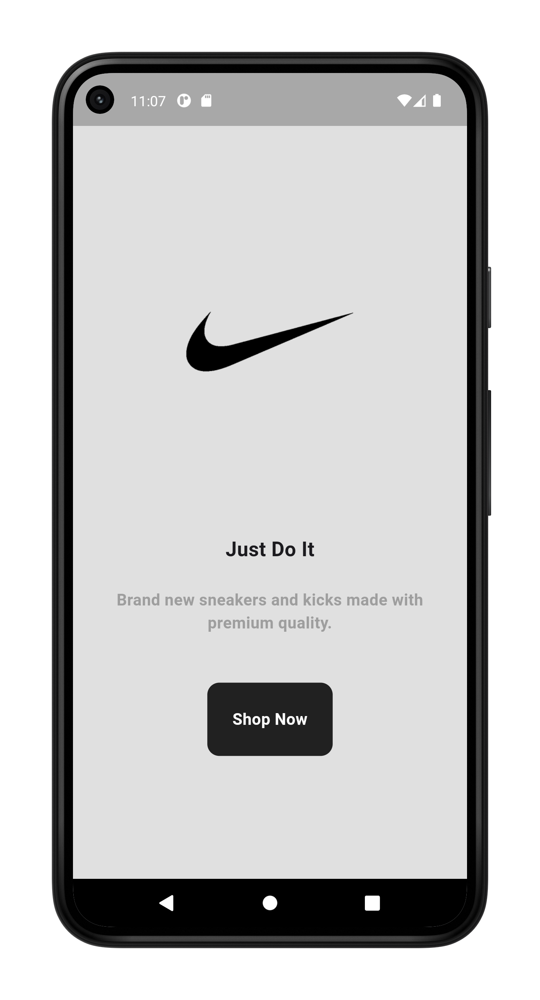
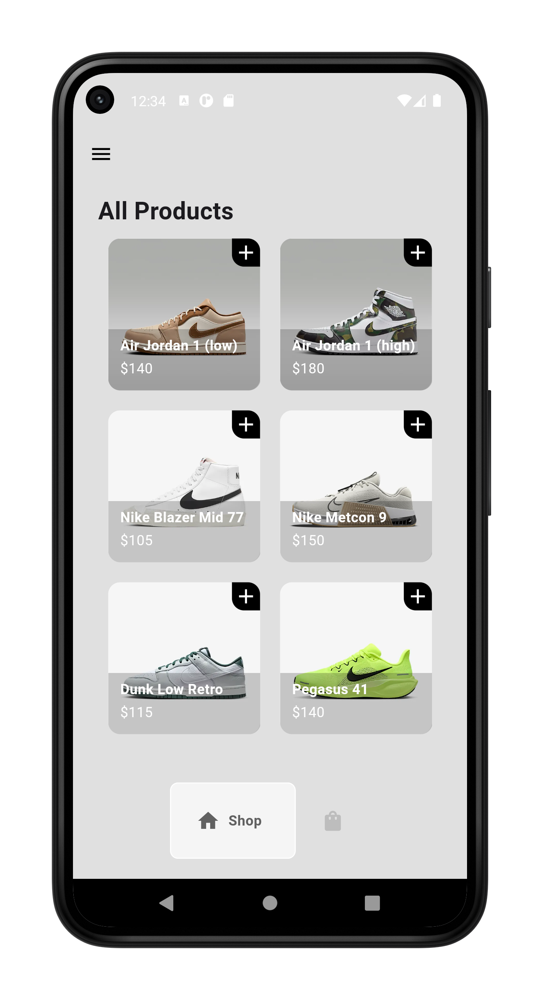
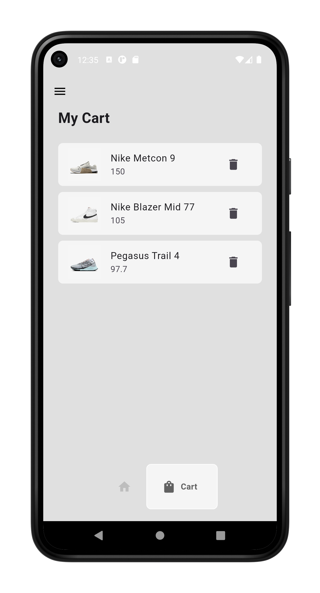
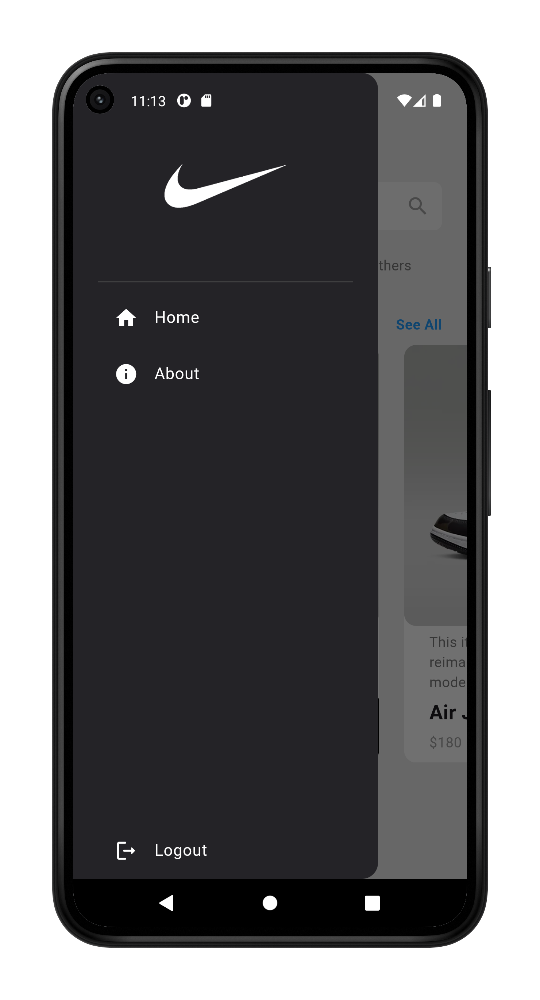

# Sneaker App

Allow you to buy sneakers. Created using Flutter

## 👨‍💻 Stack

- Framework: Flutter
- State Management: Provider


## 🧬 Samples

| Intro Screen | Shop Screen | All Products |
|---------|---------|---------|
|         |         |         |   

| Cart Screen | Drawer | 
|---------|---------|
|         |         |  

## 💪🏼 Getting Started

# Clone the project and cd into it

```bash
git clone https://github.com/takumade/sneaker
cd ./sneaker
```

# Install dependencies

```bash
flutter pub get
```

# Run

```bash
flutter run
```

## 🌻 Motivation

I am relearning Flutter, so I am practising......

## 🔗 Links

Special thanks to these people...

- [Mich Koko](https://github.com/mitchkoko)
